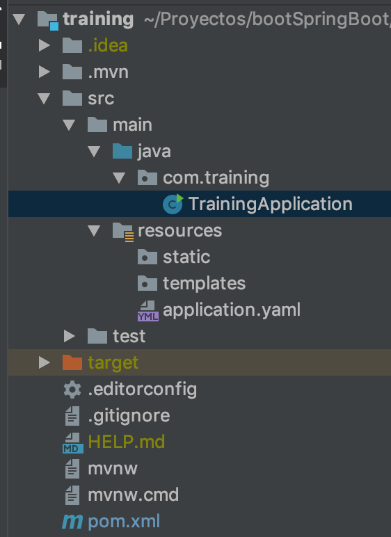

# 1- Primeros pasos

En este paso veremos algunos aspectos básicos del proyecto tales como la estructura de carpetas y archivos principales.

Antes de inciar, debemos clonar el repositorio donde se encuentra todo el proyecto que estaremos viendo en este training.
```bash
$ git clone git@github.com:regueira/BootSpringBoot.git
```
Esto habrá generando la carpeta `BootSpringBoot`. 

Dentro de la carpeta recién creada, ejecutamos el siguiente comando que restablece el entorno de desarrollo al **paso 1** de la aplicación, necesario para esta sección del training.
```bash
$ git checkout -f step-1
``` 
Debes repetir esto para cada paso futuro y modificar el número del paso al correspondiente.

> **Nota:** Al ejecutarse el comando, se limipiará el entorno de desarrollo haciendo que se pierdan los cambios que se hayan realizado y dejandolo listo para continuar.


## 1.1- Estructura general del proyecto

### 1.1.1- Revisando el POM

Para poder arrancar, tenemos que revisar y entender el archivo `pom.xml` de Maven. Se encuentra en la raiz del proyecto y se puede abrir con cualquier editor de texto.

En el pom.xml, podemos encontrar como es el build del proyecto, la versión de Java que se utiliza, dependencias del proyecto y muchas cosas más. 

```xml
...
<properties>
    <java.version>8</java.version>
</properties> 
...
```
Es importante destacar que vamos a estar usando Java 8.

Como estaremos crenado una Rest API, contaremos con el starter web de Spring boot, entre otras dependencias.
```xml
<dependencies>
    <dependency>
        <groupId>org.springframework.boot</groupId>
        <artifactId>spring-boot-starter-web</artifactId>
    </dependency>
    ...
</dependencies>
```

> **Nota:** Todos los IDEs modernos soportan y permiten importar un proyecto Maven ya existente.


### 1.1.2- Estructura de carpetas



Dentro de las carpetas `src.main.java` y del package `com.training` se encuentra el archivo `TrainingApplication.java` donde se encuenta el `main` de la aplicación de Spring Boot.


```java
@SpringBootApplication
public class TrainingApplication {

    public static void main(String[] args) {
        SpringApplication.run(TrainingApplication.class, args);
    }
}
```

La annotation `@SpringBootApplication` le indica al framework que este es el punto de partida de la app. 

El método `main` es el encargado de inicializar todo nuestro proyecto de Spring Boot, inicializando todo el contexto necesario. 

### 1.1.3- Ejecutando el proyecto

Para correr el proyecto, con una consola nos situamos en la raiz del proyecto y ejecutamos `mvn spring-boot:run`.
Debieras ver algo parecido a:
```bash
  .   ____          _            __ _ _
 /\\ / ___'_ __ _ _(_)_ __  __ _ \ \ \ \
( ( )\___ | '_ | '_| | '_ \/ _` | \ \ \ \
 \\/  ___)| |_)| | | | | || (_| |  ) ) ) )
  '  |____| .__|_| |_|_| |_\__, | / / / /
 =========|_|==============|___/=/_/_/_/
 :: Spring Boot ::        (v2.1.5.RELEASE)

(...)

--- Tomcat started on port(s): 8080 (http) with context path ''
--- Started TrainingApplication in 3.076 seconds (JVM running for 3.501)
```

Podemos ver que la aplicación se encuentra inicializada en el puerto `8080` y se inició sin problemas.

> *Nota:* Para cortar la ejecución se puede usar `ctrl+c` sobre la consola donde está ejecutando.


## 1.2- Primer aplicación con Spring Boot

Ahora que sabemos que nuestra aplicación funciona, es hora de agregar un poco de codigo.
Dentro de las carpetas `src/main/java` y dentro del package `com.training`, creamos el archivo `PrimerPaso.java` con el siguiente código:

```java
package com.training;

import org.springframework.web.bind.annotation.GetMapping;
import org.springframework.web.bind.annotation.RestController;

@RestController
public class FirstStep {

    @GetMapping("/inicio")
    public String step1() {
        return "Step 1- BootSpringBoot";
    }
}
```
Lo primero a destacar es la annotation `@RestController`. Esto le indica a Spring que la clase tiene un rol especifico. En este caso, es un controller rest y Spring lo tendrá presente cuando haya un request web.  

La annotation `@GetMapping` provee inforamción de ruteo. En este ejemplo, si llega un request HTTP tipo GET con la ruta `/inicio` debe ser mapeado al método `step1`. El "return type" del método indica que Spring debe devolver un texto como respuesta. 


Ejecutamos el proyecto como vimos en el punto anterior y en un navegador abrimos la página `http://localhost:8080/inicio`. 
Debiera aparecer el texto "Step 1- BootSpringBoot".


## 1.3- Jar ejecutable

Para finalizar estos primeros pasos, crearemos un .jar que contenga toda la aplicación y pueda ejecutarse.
Basta con ejecutar `mvn package` para que nuestro proyecto quede empaquetado en el archivo `training-0.0.1-SNAPSHOT.jar` dentro de la carpeta `target`.

Para correr la aplicación, ejecutamos `java -jar target/training-0.0.1-SNAPSHOT.jar` para salir de la app usamos `ctrl+c`.


---
[Siguiente paso](02-Crud.md)
