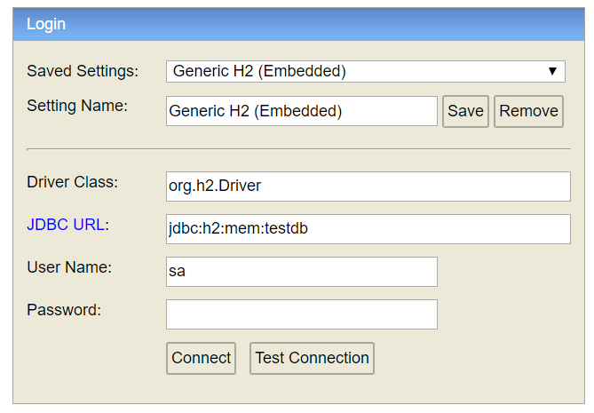

# 2- Nuestro primer CRUD


Actualizamos el entorno al **paso 2** de la aplicación.
```
$ git checkout -f step-2
``` 

Para nuestro primer CRUD vamos a utilizar como ejemplo una aplicación para administrar películas. 
##### Requerimientos:
- Cada película contará con un nombre y un género.
- Se debe poder consultar la información de una película.
- Se debe podes dar de alta una nueva película.
- Se debe poder eliminar una película.
- Se debe poder actualizar una película existente.

## 2.1. Creación de un Controller
Dentro de la carpeta `src.main.java` agregar un nuevo package `com.training.controller` para agrupar todas las clases que formen parte de la capa de controladores. Crear la clase `MovieController` teniendo en cuenta la annotation `@RestController` explicada en el paso 1 (Recordemos que no es un estereotipo, sino que engloba las annotations `@Controller` y `@ResponseBody` .<br />
Para modelar las operaciones CRUD se tendrán en cuenta las buenas prácticas del diseño de una API REST, separando nuestra API en recursos lógicos y accediendo a ellos a través de peticiones HTTP.

C (Create): POST. Crea una nueva película.<br />
R (Read): GET. Devuelve la información de una película.<br />
U (Update): PUT. Actualiza la información de una película.<br />
D (Delete): DELETE. Elimina una película existente.<br />

Ejemplo de estructura de `MovieController`:

```java
@RestController
@RequestMapping("/movies")
public class MovieController {

    @GetMapping(value = "/{id}")
    public Movie getMovie(@PathVariable Long id) {
        //TODO
    }
    
    @PostMapping
    public Movie saveMovie(@RequestBody Movie movie) {
        //TODO
    }

    @PutMapping("/{id}")
    public Movie updateMovie(@PathVariable Long id, @RequestBody Movie movie) {
        //TODO
    }

    @DeleteMapping(value = "/{id}")
    public void deleteMovie(@PathVariable Long id) {
        //TODO
    }

}
```

Descripción de annotations:
- `@RequestMapping`: se utiliza para asignar solicitudes via web a los métodos de Spring Controller correspondientes.
- `@GetMapping`: se utiliza para manejar el tipo de solicitud HTTP GET.
- `@PostMapping`: se utiliza para manejar el tipo de solicitud HTTP POST.
- `@PutMapping`: se utiliza para manejar el tipo de solicitud HTTP PUT.
- `@DeleteMapping`: se utiliza para manejar el tipo de solicitud HTTP DELETE.
- `@RequestBody`: se utiliza para asignar el body de una solicitud HTTP a un objeto del dominio (deserealización).
- `@PathVariable`: se utiliza para vincular la(s) variable(s) contenida(s) dentro del URI a los parámetros que recibe el método en el Controller.

## 2.2. Creación de un Servicio
Dentro de la carpeta `src.main.java` agregar un nuevo package `com.training.service` para agrupar todas aquellas clases que formen parte de nuestra capa de servicios. Crear la clase `MovieService` teniendo en cuenta la annotation `@Service`, que indicará que la clase pertenece a la capa de negocio.
También puede usarse el estereotipo más general `@Component`, pero es mejor ser lo más específicos posible en el contexto de Spring MVC.  

Ejemplo de estructura de `MovieService`:

```java
@Service
public class MovieService {

    public Movie findById(Long id) {
        //TODO
    }

    public Movie save(Movie movie) {
        //TODO
    }

    public void deleteById(Long id) {
        //TODO
    }
}
```

## 2.3. Creación del modelo de datos
En el paso 1 incluimos en nuestro archivo `pom.xml`la dependencia `spring-boot-starter-web`. Esta dependencia incluye otras herramientas como por ejemplo [Hibernate](https://hibernate.org/) para el Mapeo Objeto-Relacional (ORM). Hibernate nos provee una implementación de JPA (Java Persistence API) para que podamos indicar qué objetos de nuestro modelo van a ser persistidos en una base de datos. <br />
Dentro de la carpeta `src.main.java` agregar un nuevo package `com.training.model` para agrupar todas aquellas clases que formen parte de nuestro modelo de datos y agregar las clases necesarias para modelar una película y su información para seguir nuestro ejemplo.

Ejemplo de estructura de `Movie`:

```java
public class Movie {

    private Long id;

    private String name;

    private Genre genre;
    
    ...
}
```

Para getters, setters y constructor(es) podemos utilizar la librería [Lombok](https://projectlombok.org/) que nos provee un conjunto de annotations para reducir las líneas de código al escribir los métodos mencionados una y otra vez. <br />
Por ejemplo: `@Getter`, `@Setter`, `@Data`, `@NoArgsContructor`, entre otras.
Se puede agregar la librería lombok a nuestro proyecto al añadir la dependencia en el archivo `pom.xml`.
 

## 2.4. Creación de un Repositorio
Siguiendo con las capas que define Spring MVC, llegamos a la capa de acceso a datos. 
Dentro de la carpeta `src.main.java` agregar un nuevo package `com.training.repository` y crear la clase `MovieRepository`. <br />
Spring Data JPA es la parte del framework de Spring que provee herramientas para facilitarnos el desarrollo de los métodos de acceso a los datos a través de un repositorio. Para ello, basta con que nuestra clase repositorio implemente algunas de las [interfaces de Spring Dara JPA](https://www.baeldung.com/spring-data-repositories):
- CrudRepository
- PagingAndSortingRepository
- JpaRepository

En este caso usaremos `JpaRepository` ya que la misma proporciona métodos relacionados con JPA que se explicará en el próximo paso. Para poder utilizar las funcionalidades de Spring Data JPA, debemos incluir en el archivo `pom.xml` el starter de JPA (que agrupa todas las dependencias necesarias): 

```xml
...
<dependency>
     <groupId>org.springframework.boot</groupId>
     <artifactId>spring-boot-starter-data-jpa</artifactId>
</dependency>
...
```

Ejemplo de estructura de `MovieRepository`:

```java
public interface MovieRepository extends JpaRepository<Movie, Long> {
}
```
Una vez implementada la interfaz tenemos acceso a todos los métodos que la misma provee para el acceso a datos sin la necesidad de escribir el código para la funcionalidad, por ejemplo: `findById`, `save`, entre otros. <br />

Por último, debemos indicar qué clase(s) de nuestro modelo serán persistidas, es decir, se mapearán a tablas de la base de datos. <br />
Hibernate provee la annotation `@Entity`, y al mapearse nuestra clase a tabla es necesario especificar qué atributo es la clave primaria con la annotation `@Id`.

```java
@Entity
public class Movie {

    @Id
    @GeneratedValue(strategy = GenerationType.AUTO)
    private Long id;

    private String name;

    @Enumerated(value = EnumType.STRING)
    private Genre genre;
    
    ...
}
```

La annotation `@GeneratedValue` indica la estrategia de generación de la clave primaria al insertarse una fila en la tabla. Los distintos tipos de estrategia serán detallados en el paso 3. <br />
Por último, nos centraremos en el género de una película. Al ser un `Enum` debemos indicar el tipo en el que queremos almacenarlo, que puede ser `@Enumerated(value = EnumType.ORDINAL)` o `@Enumerated(value = EnumType.STRING)`. 


## 2.5. Configurando JPA con H2
Una vez que tenemos definidos nuestro modelo para ser persistido, necesitamos contar con una base de datos. Utilizaremos H2, que es una base de datos relacional en memoria (esto significa que los datos solo vivirán durante la ejecución de nuestra aplicación y cuando esta termine se perderán).

1) Agregar la dependencia en el archivo  `pom.xml`:
```xml
...
<dependency>
     <groupId>com.h2database</groupId>
     <artifactId>h2</artifactId>
     <scope>runtime</scope>
</dependency>
```
2) Spring realiza las configuraciones del data source elegido por nosotros, pero necesita que indiquemos ciertos datos para saber cómo configurar. Especificaremos esos datos en el archivo `application.yaml`:

```yaml
spring:
  datasource:
    url: jdbc:h2:mem:testdb
    driverClassName: org.h2.Driver
    username: sa
    password:
```
Usaremos el nombre por default para una base de datos H2 `testdb`y proporcionaremos un usuario y password para poder conectarnos desde la consola.

3) Por último, podemos acceder a la consola de H2 para hacer las consultas necesarias a nuestra base de datos en memoria una vez que iniciamos nuestra aplicación Spring Boot.
```
http://localhost:8080/h2-console/
```




## 2.6. Probando la aplicación con Postman
[Postman](https://www.getpostman.com/) es una herramienta que nos permite probar servicios web con solo indicar la url que definimos en nuestro controlador, el método HTTP correspondiente y los parámetros necesarios. <br /> 
Se adjunta la Collection de Postman en la carpeta [postman](https://github.com/regueira/BootSpringBoot/tree/master/postman) con los métodos de nuestro CRUD para ser importada una vez instalada la herramienta: File -> Import... y lista para usar! 

---
[Siguiente paso](03-SpringData.md)
