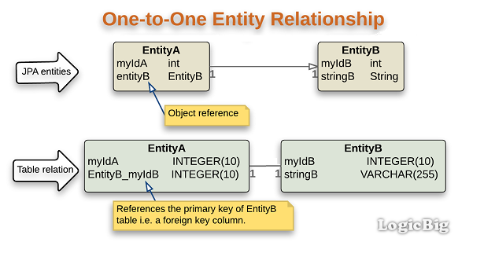
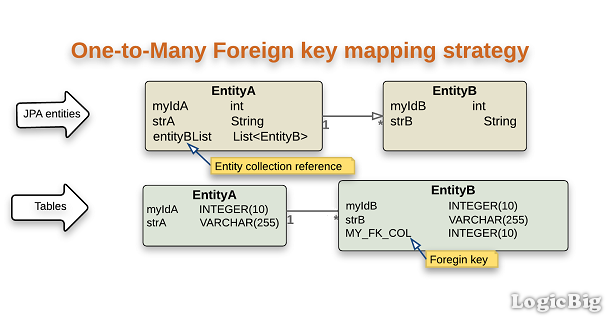
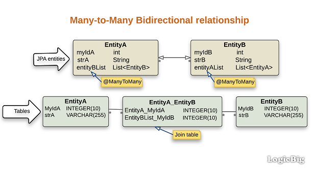

# 3- Spring Data - JPA


Actualizamos el entorno al **paso 3** de la aplicación.
```
$ git checkout -f step-3
```

## 3.1. Mapeo de entidades
Continuando con nuestra aplicación de películas, en este paso se agregarán más clases al modelo para poder mapear 
las relaciones entre ellas.


### 3.1.1. Mapeo de un objeto
Como ejemplo se modelará la clase Actor: 

```java
@Entity(name = "actors")
public class Actor {

    @Id
    @GeneratedValue(strategy = GenerationType.AUTO)
    private Long id;

    private String name;
}
```
A continuación se explicarán las annotations nuevas:
- `@Entity`: indica que nuestro objeto representa una tabla en la base de datos, a la que podemos renombrar 
con el nombre `actors`. Si no indicamos ningún nombre la tabla se llamará igual que la entidad.<br />
- `@Id`: indica qué columna será la clave primaria de la tabla.
- `GenerationType`: JPA soporta cuatro estrategias para la generación de la clave primaria:
    - `GenerationType.AUTO`: indica que la estrategia de generación de clave será el de la base de datos que elegimos.
La mayoría utilizan `GenerationType.SEQUENCE`. 
    - `GenerationType.IDENTITY`:  se basa en auto-incrementar el valor de la clave primaria y permite que la base de 
datos genere un nuevo valor con cada operación de inserción. 
- `GenerationType.SEQUENCE`: utiliza una secuencia de base de datos para generar valores únicos. Requiere instrucciones 
de selección adicionales para obtener el siguiente valor de una secuencia pero esto no tiene impacto en el rendimiento 
para la mayoría de las aplicaciones.
- `GenerationType.TABLE`: generalmente no se utiliza. Genera una secuencia almacenando y actualizando su valor actual 
en una tabla.
<br /><br />
Adicionalmente, se puede utilizar la annotation `@Column` para agregar algunas propiedades a las columnas o renombrarlas.


### 3.1.2. Mapeo de relaciones
En este punto las clases serán tratadas como tablas en una base de datos relacional. Una relación es una conexión entre
dos entidades. En JPA, esas relaciones pueden ser:

- `@OneToOne`: significa que cada fila de una entidad se refiere a una y solo una fila de otra entidad.



- `@OneToMany`: se refiere a la relación entre dos entidades en la que una fila de una entidad puede estar vinculado con 
muchos elementos de la otra entidad, pero un elemento de B está vinculado a un solo elemento de A. 
Se define utiliando las annotations `@OneToMany` and `@ManyToOne`. 




- `@ManyToMany`: se da cuando una o más filas de una entidad están asociadas con más de una fila de otra entidad.



A modo de ejemplo, agregaremos una relación `@ManyToMany` entre `Movie` y `Actor` porque "un actor puede haber actuado en
muchas películas y en una película pueden actuar varios actores." <br />
Clase `Actor`:

```java
@Data
@Entity(name = "actors")
@AllArgsConstructor
@NoArgsConstructor
public class Actor {

    @Id
    @GeneratedValue(strategy = GenerationType.AUTO)
    private Long id;

    @Convert(converter = PersonNameConverter.class)
    private PersonName name;

    @ManyToMany
    @JsonIgnoreProperties("actors")
    private List<Movie> movies;

}
```
<br />

Clase `Movie`:
```java
@Data
@Entity(name = "movies")
@AllArgsConstructor
@NoArgsConstructor
public class Movie {

    @Id
    @GeneratedValue(strategy = GenerationType.AUTO)
    private Long id;

    private String name;

    @Enumerated(value = EnumType.STRING)
    private Genre genre;

    @ManyToMany(mappedBy = "movies")
    @JsonIgnoreProperties("movies")
    private List<Actor> actors;

}
```

Como consecuencia de esta relación, se creará una tabla llamada "Join table" en donde se guardarán las dos claves primarias 
de `Actor` y `Movie`. <br />
Se eligió como entidad propietaria (es decir, donde se configura la relación) a `Actor`. <br />

Verificar ingresando a la consola de H2.

### 3.1.3. AttributeConverter
Un `AttributeConverter` nos permite implementar métodos para convertir el valor de un atributo de entidad a su representación 
en la base de datos y viceversa. <br />
Nuestro converter debe implementar la interfaz `AttributeConverter` y llevar la annotation `@Converter`. <br />
Vamos a crear un Converter para el nombre de los actores.

```java
@Converter
public class PersonNameConverter implements AttributeConverter<PersonName, String> {

    @Override
    public String convertToDatabaseColumn(PersonName personName) {
        //TODO
    }

    @Override
    public PersonName convertToEntityAttribute(String dbPersonName) {
        //TODO
    }
}

```

Donde `PersonName` es la entidad que será representada como un `String` en la base de datos. <br />
Ahora debemos crear la entidad `PersonName` y reemplazar el nombre de los actores por la misma como se muestra a continuación.

```java
public class PersonName {

    private String name;
    private String lastname;
}
```
```java
@Entity(name = "actors")
public class Actor {

    ...

    @Convert(converter = PersonNameConverter.class)
    private PersonName name;
}
```

Hay dos formas de usar un Converter. La primera es utilizar `autoapply = true` en la annotation `@Converter` 
de la clase Converter. En este caso, el proveedor de JPA usará este Converter para convertir todos los atributos del tipo dado. <br />
Por ejemplo: 

```java
@Converter(autoApply = true)
public class PersonNameConverter implements AttributeConverter<PersonName, String> {
    
}
```

La segunda opción es cuando no se especifica la opción `autoApply` y toma el valor por default como false. En este caso
se debe agregar la annotation `@Convert` en todos los atributos que se convertirán y especificar la clase Converter. 


---
[Siguiente paso](04-DTOs.md)
